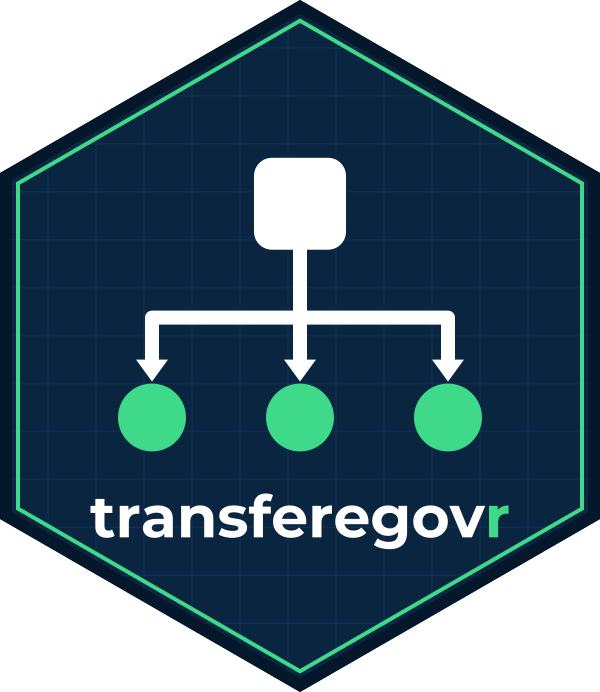
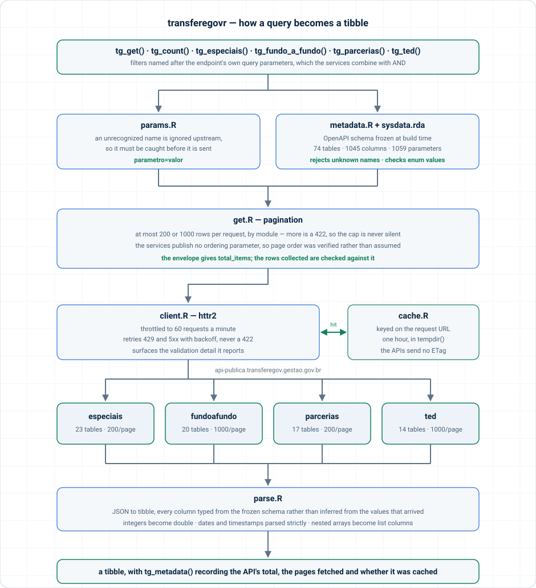

<!-- README.md is generated from README.Rmd. Please edit that file. -->



# transferegovr

<!-- badges: start -->

[](https://github.com/StrategicProjects/transferegovr/actions/workflows/R-CMD-check.yaml)
[](https://app.codecov.io/gh/StrategicProjects/transferegovr)
[](https://strategicprojects.github.io/transferegovr/)
[](https://www.repostatus.org/#active)
[](https://lifecycle.r-lib.org/articles/stages.html#experimental)
<!-- badges: end -->

An R interface to the open data APIs of **TransfereGov**, the Brazilian
federal government’s platform for transfers to states, municipalities
and civil society.

## What this package covers

The package targets the public API host,
`api-publica.transferegov.gestao.gov.br`, which publishes four modules
and **74 tables** in all:

| Module | Covers | Tables |
|----|----|----|
| `especiais` | Special transfers, created by Constitutional Amendment 105/2019 for individual parliamentary amendments | 23 |
| `fundoafundo` | Fund-to-fund transfers, from federal funds directly to state, district and municipal funds | 20 |
| `parcerias` | Partnership management: programs, proposals, partnerships, their financial execution and bank statements | 17 |
| `ted` | Decentralized credit between federal bodies (*termo de execução descentralizada*): programs, action plans, credit notes and financial programming | 14 |

Every table in the published data models is reachable. Where the API
folds a child table into its parent rather than giving it an endpoint of
its own, it arrives as a list column — 5 of them in `fundoafundo`, 13 in
`parcerias`, 4 in `ted` — and `tg_fields(nested = )` describes what is
inside.

### What it does not cover

- **The older PostgREST endpoints** at `api.transferegov.gestao.gov.br`,
  which version 0.1.0 of this package used. The government announced
  their retirement for 2026-08-31. They are a different and largely
  superseded contract — different column names, a handful of columns
  each way, and a `historico_pagamento_especial` table that the new
  service does not carry.
- **The Discricionárias e Legais module (SICONV)**, which has no API: it
  is published as CSV archives at
  <https://api-publica.transferegov.gestao.gov.br/downloads>. The
  government has announced APIs for it in four stages between July 2026
  and October 2027, starting with preparatory acts.

## Installation

From CRAN:

``` r
install.packages("transferegovr")
```

The development version, from GitHub:

``` r
# install.packages("pak")
pak::pak("StrategicProjects/transferegovr")
```

## Getting started

``` r
library(transferegovr)

tg_modules()
tg_tables("parcerias")
tg_fields("parcerias", "proposta")
tg_params("parcerias", "proposta")
```

`tg_get()` retrieves rows. Each filter is named after one of the
endpoint’s own query parameters, and parameters combine with AND:

``` r
tg_get(
  "parcerias", "proposta",
  sg_uf_recebedor = "PE",
  situacao_proposta = "Aprovada",
  .limit = 20
)
```

That is almost the whole filtering vocabulary. These services compare
for equality — no greater-than, no pattern match — and publish no
ordering or column-selection parameter. The one extension is on
identifiers: 113 of them take several values and match any, which
`tg_params()` marks as `multiple`:

``` r
tg_get("ted", "planos_acao_metas", id_plano_acao = c(3, 4))
```

`tg_params()` lists what each table accepts, including the permitted
values of the enumerated parameters.

## A typo must not look like an answer

These services **ignore a query parameter they do not recognize** and
answer `200` with the whole table. Misspell `situacao_proposta` and you
get 89,415 rows where the filter would have given 85,041 — a plausible
number, quietly wrong.

So every parameter name is checked against the packaged schema before a
request goes out:

``` r
tg_count("parcerias", "proposta", in_situacao_proposta = "Aprovada")
#> Error in `tg_count()`:
#> ! Unknown filter: "in_situacao_proposta".
#> ✖ The API ignores a parameter it does not recognize and returns every row, so
#>   this would look like a query that matched nothing in particular.
#> ℹ Did you mean "situacao_proposta"?
```

Enumerated values are checked the same way, before the round trip rather
than after it.

## Size first, download second

Each request returns one page — at most 200 rows in `especiais` and
`parcerias`, 1000 in `fundoafundo` and `ted` — and these tables are not
small. Ask before you fetch:

``` r
tg_count("especiais", "meta_especiais")
#> [1] 156193
```

`.limit` counts rows, not pages. Anything above one page is collected
page by page, and the total collected is checked against what the API
reported:

``` r
metas <- tg_get("especiais", "meta_especiais", .limit = Inf)

tg_metadata(metas)$total_rows
tg_metadata(metas)$pages
```

## Types

Columns are typed from the API’s own schema rather than guessed, so a
column that happens to be entirely null on one page does not change
class on the next:

``` r
proposals <- tg_get("parcerias", "proposta", .limit = 5)

class(proposals$dt_proposta)
#> [1] "Date"
class(proposals$intervenientes_proposta)
#> [1] "list"
```

## Freshness and caching

Each module reports when it was last loaded, which is the only freshness
signal these APIs give — they send no `ETag`, `Cache-Control` or
`Last-Modified`:

``` r
tg_updated_at("parcerias")
#> [1] "2026-09-28 UTC"
```

Responses are cached for an hour in the session’s temporary directory,
so nothing is written outside the session unless you ask for it. To keep
them between sessions:

``` r
tg_cache_dir(tools::R_user_dir("transferegovr", "cache"))
```

or set `TRANSFEREGOVR_CACHE_DIR` in your `.Renviron`. `tg_cache_clear()`
empties it.

## How it works



Two things in that picture are where a naive client of these APIs loses
data:

- **An unrecognized parameter is ignored, not rejected.** The request
  succeeds and returns everything. Validating names client-side is the
  only defense, which is why the packaged schema freezes the parameter
  list and not just the columns.
- **Repeating a parameter does not combine conditions.** The service
  keeps the last occurrence and discards the rest without saying so. A
  parameter that takes several values wants them in one comma-separated
  value instead, and which parameters do is not in the OpenAPI documents
  — it was established by asking the service. So the package sends a
  list only where the service reads it as one, and refuses a repeated or
  multi-valued filter everywhere else.

Page order is the server’s — these APIs publish no ordering parameter —
so it was verified rather than assumed: the same rows come back in the
same sequence across page sizes, across repeated calls, 100,000 rows
deep, on tables with no key, and on tables with nested columns.
`tests/testthat/test-live.R` keeps checking it.

## Column names are in Portuguese

Table names, column names, parameter names and categorical values belong
to the API and are left as the government publishes them. The package’s
own functions, arguments and documentation are in English, with
Portuguese aliases (`tg_obter()`, `tg_contar()`, `tg_tabelas()`,
`tg_campos()`, `tg_parametros()`, `tg_atualizado_em()`) for the exported
verbs.

## Related

- [obrasgovr](https://github.com/StrategicProjects/obrasgovr) — the
  ObrasGov public works API.

## Official documentation

- <https://api-publica.transferegov.gestao.gov.br/especiais/docs>
- <https://api-publica.transferegov.gestao.gov.br/fundoafundo/docs>
- <https://api-publica.transferegov.gestao.gov.br/parcerias/docs>
- <https://api-publica.transferegov.gestao.gov.br/ted/docs>
